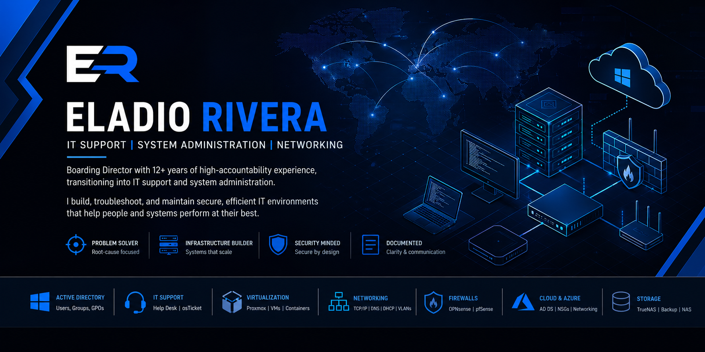

  

<h1 align="center">Eladio Rivera</h1>

  IT Support | System Administration | Active Directory | Networking | Troubleshooting

---

## 🚀 About
Operations leader with 12+ years managing high-accountability environments, now transitioning into IT support and system administration.

Building hands-on technical experience through lab environments and practical projects across Active Directory, Azure, virtualization, and networking, with a focus on troubleshooting, system reliability, and user support.

---

## 🛠 Core Skills
- Active Directory & user management  
- Windows / Azure environments  
- Virtualization (Proxmox)  
- Networking (TCP/IP, DNS, DHCP, VLANs)  
- Firewall configuration (OPNsense / pfSense)  
- Help desk workflows & ticketing systems (osTicket)  
- Troubleshooting & system diagnostics  
- Technical documentation  

---

## 💻 Projects

### 🔹 Homelab Infrastructure (System Administration & Networking)
👉 **[View Project](https://github.com/erivera3/homelab-infrastructure)**  

**Overview:**  
Built a multi-system lab environment using Proxmox (virtualization) and TrueNAS (storage). Deployed an Active Directory domain with internal DNS, configured firewall routing and segmentation with OPNsense, and reimaged 13 workstations into a standardized environment.

**Focus:** System administration, networking, troubleshooting, deployment  

---

### 🔹 Help Desk & Ticketing Systems (osTicket)

**Projects:**  
[Deployment in Azure](https://github.com/erivera3/osticket-prereqs/)  
[Configuration & Setup](https://github.com/erivera3/post-install-config)  
[Ticket Lifecycle Examples](https://github.com/erivera3/ticket-lifecycle)

**Overview:**  
Deployed and configured osTicket in an Azure environment. Managed ticket lifecycle from intake to escalation and resolution while simulating real user support scenarios and troubleshooting workflows.

**Focus:** Help desk workflows, user support, troubleshooting  

---

### 🔹 Azure & Active Directory

**Projects:**  
[Active Directory Deployment](https://github.com/erivera3/configure-ad/)  
[Network Security & Traffic Inspection](https://github.com/erivera3/azure-network-protocols)

**Overview:**  
Deployed a domain controller in Azure virtual machines, configured users and access controls, and analyzed network traffic to understand basic communication and security behavior.

**Focus:** Identity management, cloud systems, networking fundamentals  

---

## 🧩 What This Demonstrates
- Hands-on system setup and configuration  
- Troubleshooting and problem solving  
- Basic infrastructure and networking concepts  
- User support and system reliability  
- Ability to learn and apply technical concepts quickly  

---

## 🚨 Incident Response (Transferable Skills)

**Projects:**  
[Wildfire Incident Response System](https://github.com/erivera3/wildfire-incident-response-system/)  
Earthquake Response Protocol *(coming soon)*  
Campus Security Intruder Response *(coming soon)*

**Overview:**  
Experience managing real-world incident response in high-risk environments, including escalation, coordination, and decision-making under pressure.

**Relevance:** Directly transferable to IT incident response, escalation workflows, and operational reliability  

---

## 📘 Certifications
- [Technical Support Fundamentals – Google](https://www.coursera.org/account/accomplishments/records/YPQ25WXG5M3K)  
- [The Bits and Bytes of Computer Networking – Google](https://www.coursera.org/account/accomplishments/verify/640EJGQWAFQD)  
- CompTIA A+ (in progress)  

---

## 🎯 Current Focus
- VLAN segmentation & network design  
- Firewall deployment (OPNsense)  
- Active Directory expansion  
- Infrastructure documentation  

---

## 🤝 Connect
- [LinkedIn](https://www.linkedin.com/in/eladiorivera/)  
- [GitHub](https://github.com/erivera3)  
